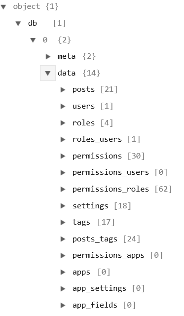

Title: Ghost Converter
Lead: Extracting posts from a Ghost blog as Markdown files
Created: 2016-03-23T11:26:56.9854628-04:00
Published: 2016-03-23T12:00:00.0000000-04:00
Tags: 
 - Tech
 - Blogging
 - Meta
---
Part of migrating to a new system is migrating data/content from the old. This is a quick "How to" post documenting how I exported old posts from my outdated [Ghost blog][GhostBlog] for import into my current [Wyam][Wyam]-based blog.

## Part 1: The Content
The content was simple. FTP to my blog instance and download the folder of images. Put those images in the new blog folder. Ghost organized images in a simple "Year/Month/Filename" folder structure, which I kept.

## Part 2: The Data
The exact path to get to the data export options in Ghost has changed as the project has matured. For my admittedly outdated instance, it was accessible via a "hidden" URL. This allowed meto download a `.json` file, which was reasonably structured. 

A lot of that information wasn't relevant to me, as a small, single-user blog user. My areas of interest were the `posts` and `tags` arrays.

Each object in `posts` has the following interesting properties (some weren't relevant to me

``` 
{
    "title": "Publishing Web Site Projects",
    "slug": "publishing-website-projects",
    "markdown": "<snipped>", // User input Markdown
    "html": "<snipped>", // HTML output generated from Markdown 
    "status": "published",
    "published_at": 1393627986715,
}
```
The only property from the `tags` entries useful to me was a `name`, and each post is linked to zero or more tags via the `posts_tags` property.

I needed individual Markdown files for each post, with the metadata intact. Wyam uses a [YAML][YAML] file header (or Frontmatter) for metadata, followed by the body of post. 

I made a quick console application to do this for me, which is available on [GitHub][GhostConverter]. It is very rudimentary, but did the job for me, more or less.

## Part 3: Cleanup
The "less" part of "more or less" is all the various small cleanup tasks I've done since then. They include things like adding a "Migrated" tag to all the legacy post files, correcting broken image links, adding some CSS classes to make the images responsive to smaller screen sizes, etc.  For these simple mass edits, I've just used [Sublime Text][Sublime]

[GhostBlog]:https://github.com/TryGhost/Ghost
[Wyam]:http://wyam.io/
[GhostConverter]:https://github.com/jcgillespie/GhostConverter
[YAML]:http://yaml.org/
[Sublime]:https://www.sublimetext.com/