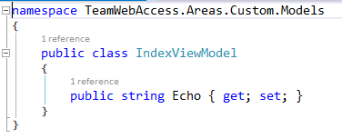
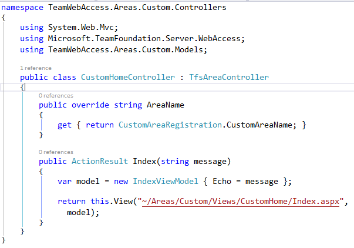
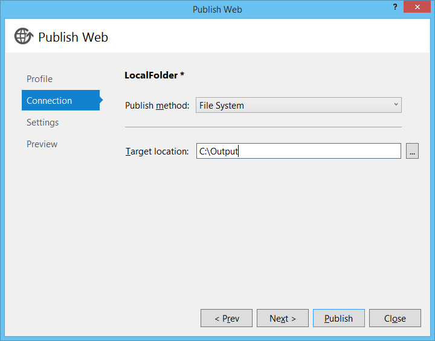
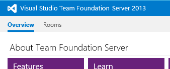

Title: How to Extend TFS Team Web Access
Created: 2014-08-28T19:21:05.8840000+00:00
Published: 2014-09-02T12:50:57.1940000+00:00
Tags: 
 - ALM
 - TFS
 - Tech
 - Migrated
---
[TFS Team Web Access (TWA)][MSDNTWA] is a great tool for low-friction access to the development process. It has improved by leaps and bounds in the last few releases, but what if you want even more? Maybe you've seen vendors with products that augment TWA and wondered how you can do it yourself. Or maybe you're like me and just like to tinker for curiosity's sake.

Clients often ask if they can customize/extend TWA and the short answer is "It isn't supported". But if you *really* want to extend TWA, the slightly longer answer is "Yes, but it isn't supported." Here's how you do exactly that.

## Objective
We're going to add custom code to the TFS Team Web Access application and extend it with whatever we want.

Taking this

And adding a tab of our own.

## Warning
**I'm not kidding. This really isn't supported. If you wreck your server trying this, Microsoft isn't going to help you. What follows is provided "as is" with no warranty from a random guy on the internet.**

This is unsupported because it uses undocumented extension APIs in TWA. Undocumented/unsupported means Microsoft can change them at any time. Clearly, they've done some prep work for this, but evidently aren't ready to support it yet. Documenting (and thus supporting) the extension API is currently the [9th most popular TFS request on User Voice][UserVoice]. The product team hasn't weighed in on it and it dates back to November of 2012, so I wouldn't hold my breath. If they change the APIs, this may all suddenly stop working.

With that out of the way, let's get started!

## What you'll need
You will need admin access to an instance of Team Foundation Server. Please use common sense and don't use your production server. These instructions are for TFS 2013 and were tested against both update 2 and 3 (2013.2 & 2013.3).

You'll need the code editor of your choice. I'm using Visual Studio 2013. Use whatever you like.

## Step 1: Create the the empty web app
First we need to create a solution that mimics/mocks the structure of TWA. Create an empty .NET 4.5 Web Application Project. Versions are very important throughout this process. For TFS 2013, make sure you select .NET 4.5, not 3.5 or 4.5.1, or anything else. 

Update the web.config so it looks like the following:

Or for the copy/paste inclined:

    <?xml version="1.0"?>
    <configuration>
      <appSettings>
        <add key="webpages:Version" value="2.0.0.0"/>
      </appSettings>
      <system.web>
        <compilation debug="true" targetFramework="4.5"/>
        <httpRuntime/>
        <pages controlRenderingCompatibilityVersion="4.0"/>
     </system.web>
    </configuration>
This is mostly to assist Intellisense while you're coding, because the next step is to ensure this file is never deployed. 
View the Properties dialog for the web.config and set the Build action to "None". "Copy to Output Directory" should already be set to "Do not copy", but double check and make sure. We don't want to overwrite the web.config that is already on the server.

## Step 2: Make the empty project more empty
If you have any web.config transforms, remove them. Again, we're not deploying the web.config, so these transforms won't do us any good.

Next we remove almost all the references that are added to the project by default. Leave in Microsoft.CSharp, System, System.Core, and System.Web.

When this is all said and done, you should have a very empty, very stripped down Web Application. Here's what mine looks like.

## Step 3: Add in MVC
Now we can start adding to the app. This needs to match what is in the TFS application. For TFS 2013, install last version of MVC 4. I'm using NuGet, but you can do this manually if you'd rather. 

    Install-Package Microsoft.AspNet.Mvc -Version 4.0.30506 
Again, because these are already in TFS, we don't want to overwrite them when we deploy. Go to the property view for each added reference and set the "Copy Local" to false.

At this point, none of the references in the solution should be set to Copy Local. If you build the solution and check the `/bin/` directory, it shouldn't have anything but the project dll and pdb file.

>For me, Visual Studio actually outputs the web.config Contents to the `/bin/` as an <appname>.dll.config file, but MSBuild doesn't. I have no idea why this is, but [I'm not the only one][StackOverflow]
 
## Step 4: Copy the TFS Master pages
Next we'll pull the TFS master pages into the application so we can reference them. Add a `_views` folder to the root of the application. This matches the structure of the TFS application.

Now connect and to your TFS server and browse to the install directory. For me, this was `C:\Program Files\Microsoft Team Foundation Server 12.0\`. Navigate to the `\Application Tier\Web Services\_views\` subdirectory and decide which master pages you want to use for your customizations. Copy those into your application, maintaining whatever folder structure they had in TFS. Make sure you get the hierarchy of master pages. Some of them use others.

I chose to use `\Shared\Masters\HubPage.master` which references  `\Shared\Main.master`, so I copied those two.

Once again, we don't want to include this in the deployment, so set the "Build Action" to "None" and "Copy to output directory" to "false".

The TWA master pages derive from a custom base class `TfsViewMasterPage`, so we'll need to grab a couple DLLs for this to compile. Go back to your TFS install directory  and grab a copy of the following DLLs from the `\Application Tier\Web Services\bin` folder.

* Microsoft.TeamFoundation.Server.WebAccess.dll
* Microsoft.TeamFoundation.Server.WebAccess.Platform.dll

Add these to your solution and reference them in your project. Once again, ensure they are not copied to the output directory.

## Checkpoint
So far, we've created a pretty empty web application project that mimics the TWA. Building the solution outputs an empty DLL and nothing else. This is the foundation of our extension. From here on out, we'll start adding code that gets deployed. If you're working with source control, now is a great time to check in. If you wanted to create a Visual Studio project template, this would be a good place to do that too. I've added a few housekeeping things and checked my solution in. This is what my Solution looks like now.

## Step 5: Start Extending!
The organization of your customizations isn't critical like it was for previous steps, though you probably don't want to stomp on other TWA files. I like to keep my customizations very cleanly away from everything TWA related, so I'm going to create an MVC Area for my customization.

Warning: TWA requires that all controllers have unique names. If you pick a name that collides with another controller, you'll get a exception like 
> Multiple MVC controllers found with name 'HomeController'.
Web Access uses generic routes (for all controllers) that do provide namespace constraints for controller do not have a controller namespace constraint, so this check enforces unique controller names to make sure selection. So we do this controller-name-uniqueness check upfront to fail fast and avoid bugs caused by issues during runtime.

That's right, the default controller isn't a unique name, so give it a new one. I just called mine `CustomHomeController`.

Because TWA uses a custom ViewEngine with non-standard view locations, it won't find our view in the usual location. We do have a few options though.

1. Put our views in with the built-in views (`\_views\`) folder. No, thank you. This ups the risk of stepping on the TWA functionality or being stepped on in updates.
2. Pull our views out of the Area folder and put them in the usual root `\Views\` folder. This is a little better, but I much prefer areas to keep the app cleanly organized.
3. Specify the views with fully qualified paths. This is what I'm doing for now.

There is another option that is pretty slick, but it takes us deeper into unsupported territory. I'll try to blog about that one in the future.

The Controller, Model, and View are all standard and simple. I'm just creating a method that echos the user input.

Note that the view is using the master page we copied in. For this master, I want to put my Content in the "HubContent" placeholder.

Because we're using the TWA master, our controller has another constraint. Remember the master page derives from a custom base class. That base class expects some objects to be initialized and populated, so instead of deriving from `System.Web.Mvc.Controller`, we need to derive from `Microsoft.TeamFoundation.Server.WebAccess.TfsAreaController`. The `TfsAreaController` will handle the objects the master pages expect. If you skip deriving from that class, you'll end up with a vague `NullReferenceException`.

Change the base class and implement the members it requires. Here's my controller. I'm made the Area name a constant and resused it here.

## Step 6: Wire it up
If you were to deploy this right now, nothing would happen. The TWA app handles routing differently than the usual MVC setup. The routing is a little more dynamic, which allows the same component to work at different "levels" of TFS whilst maintaining a REST-ful URL. For example, your customization might be useful at the Project Collection and Team Project level. 

The navigation is organized into Hub Groups and Hubs. In the image below, items in the red box represent Hub Groups and the items in the green box are Navigation Hubs. MVC Routes are generated based on the setup of the registered navigation hubs. A single component could have a number of routes, all of which are generated and registered by the TWA app.

We need to register our extension into this navigation system. Open the Area Registration class. You can zap the default route registration that shows up there. TWA will ignore it anyway. 

We need to create and register a `NavigationHub`. I added a private static `CreateHub()` method

    private static NavigationHub CreateHub()
    {
        var customHub = new NavigationHub();
        return customHub;
    }
and registered it.
 
    public override void RegisterArea(AreaRegistrationContext context)
    {
       var hub = CustomNavigationHubFactory.Create();
       NavigationTable.Hubs.Add(hub);
    }
That creates an empty hub and registers it. So now we need to configure the hub. Looking at the properties on the `NavigationHub` class, the first thing we want to set is the `NavigationLevels`. Let's make our extension available at the Project and Team levels. This controls when the NavigationHub is displayed in the TWA menu. It does NOT control accessibility of the components, which we'll get to a little later.

The other property we want right now is the `QueryStatusCallback`. This callback allows us to provide TWA with the links and display details for our custom `NavigationHub`.

1. Getting the route for the current request context. This will change based on the Navigation Level.
2. Building the a link to the Action we want to execute.
3. Checking if the NavigationHub is currently selected.

The last thing we need to do before deployment is decorating the controller with an attribute that controls the accessibility of the component. This is typically going to be the same as the `NavigationHub.NavigationLevels` property, but it doesn't have to be. We'll make it easy to keep them in sync.

On the AreaRegistration class, I refactored the NavigationLevels I set on the CreateHub method into a public constant.

    public const NavigationContextLevels CustomAreaLevels = NavigationContextLevels.Project | NavigationContextLevels.Team;

Then I decorated the controller with the `SupportedRouteArea` attribute.

## Step 7: Deploy it!
I recommend deploying to some folder and inspecting carefully before just pushing this onto your server, so let's setup a publish profile for that. (If you're new to publish profiles, check out my [intro][MSDeploy])

Create a new publish profile that points to a folder.

Click Publish and go look at the output. It should be really sparse. A `/bin/` folder with just the one DLL and the `/Areas/` folder with our custom views. If there is anything else in there, go double-check the properties and make sure they are right.  Once the output is looking good, you can either copy the output to your TFS install directory or setup another publish profile.

If you're copying or using a file system type publish method, the target folder is the `Application Tier\Web Service\` folder under the TFS install directory. For me, that is `C:\Program Files\Microsoft Team Foundation Server 12.0\Application Tier\Web Services`. 

You may need to go to IIS manager and restart the TFS Web app for it to pick up the changes. 

Now browse to your instance of TWA.

Nothing shows, but that's okay because registered our extension at the Team and Project level and this is the collection level. Browse to a Team Project.

That's looking better.

Now click on the extension

Bingo!

And you still get the goodness of MVC Model Binding. My method was an Echo service accepting a message. If I add `?message=Hello` to the URL, it'll be picked up by the Controller and handed to the View via the Model.

And there you have it! That's how you get started extending TFS Team Web Access.

The sample solution is available on [GitHub][TeamWebAccess]. Discuss on [Hacker News][HN].

### References
* [MSDN: Working with Team Web Access][MSDNTWA]
* [User Voice: Provide API documentation for the customization of TFS Web Access 2012][UserVoice]
* [StackOverflow: Visual Studio copies .config to bin on build, but MSBuild doesnot][StackOverflow]
* [Scott Hanselman: Mixing Razor Views and Web Forms Master pages with ASP>NET MVC3][ScottHa]
* [Matt Hawley: Using Razor Pages with WebForms Master Pages][MattHa]
* [await wisdom: A quick introduction to web publish profiles][MSDeploy]
* [GitHub: Sample solution][TeamWebAccess]
* [Hacker News: Discussion][HN]

### Credits
* [Image Credit: Eirik Solheim][VoidWarranty]

[MSDNTWA]:http://msdn.microsoft.com/en-us/library/ee523998.aspx
[VoidWarranty]:https://flic.kr/p/5SWkC9
[UserVoice]:http://visualstudio.uservoice.com/forums/121579-visual-studio/suggestions/3352200-provide-api-documentation-for-the-customization-of
[StackOverflow]:http://stackoverflow.com/q/21070675/55142
[ScottHa]:http://www.hanselman.com/blog/MixingRazorViewsAndWebFormsMasterPagesWithASPNETMVC3.aspx
[MattHa]:http://www.eworldui.net/blog/post/2011/01/07/Using-Razor-Pages-with-WebForms-Master-Pages.aspx
[MSDeploy]:http://awaitwisdom.com/intro-to-web-publish-profiles/
[TeamWebAccess]:https://github.com/jcgillespie/Demos/tree/master/TeamWebAccess
[HN]:https://news.ycombinator.com/item?id=8257204