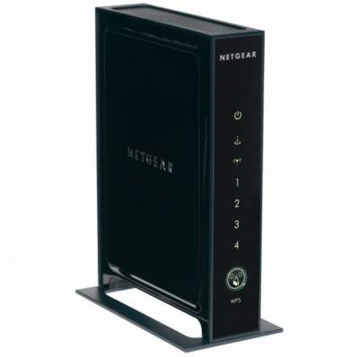
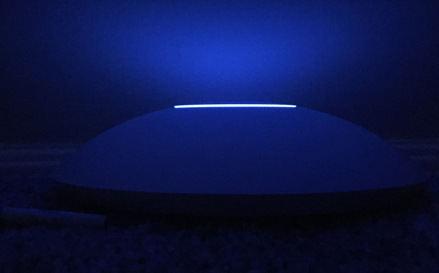
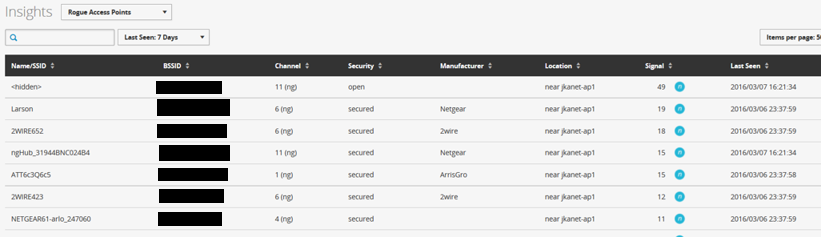

Title: WiFi with UniFi   
Lead: A new network
Created: 2016-04-02T10:09:45.5036296-05:00
Published: 2016-04-02T15:00:00.0000000-05:00
Edited: 2016-04-07T18:56:16.8748186-05:00
Tags: 
 - Tech
 - Network
---
I have had a Netgear WNR3000L Wireless Router for several years and it was starting to have some issues. The wireless network would just disappear several times a day, and rebooting the router was the only fix.  That router is open-source capable, so I'd tried the DD-WRT and TomatoWRT firmwares in addition to the stock image. Switching the image didn't seem to help, so I suspect there was some failing hardware inside.

My modem is in a corner of the basement where the cable enters the house. I didn't want the WiFi access point there, so I have a little Cisco RV180 as my router/DHCP/firewall and the Netgear was in AP-only mode upstairs in the guest bedroom.

I was kind of passively looking for a replacement when I happened upon [this article][Ars], which was the first I'd heard of [Ubiquiti][ubnt] and the [UniFi][unifi] products. I picked up the [Long-Range flavor][AC-LR], primarily because the Pro’s were out of stock, the LR's were cheaper, and they met my needs for now.

The AP supports Power over Ethernet and comes with a PoE injector.  I put the PoE injector downstairs with the router, and the AP is upstairs under a dresser, happily powered with just the PoE.

Although it isn’t strictly needed, I did go ahead and setup the Unifi Controller, which I’ve got living in Azure. Setting that up could be the subject of a future post. A couple screenshots from my controller dashboard are below.

_Connected clients_

_Nearby networks_

Replacing the old WiFi was pretty easy, but the access point is more than just a drop in replacement. It was also easy to set up an isolated guest wireless network. The AC speed is pretty nice too.  If I find that I need better coverage or capacity, adding a new access point is trivial. I'll just need to plug it in and point it at the controller. It will connect and the controller will push my configuration down to the AP. 

I’m loving the setup. It's been rock solid so far. I’ll probably replace my Cisco RV180 (which is also starting to show age) with a [UniFi Security Gateway][USG] in the near-ish future.

[Ars]:http://arstechnica.com/gadgets/2015/10/review-ubiquiti-unifi-made-me-realize-how-terrible-consumer-wi-fi-gear-is/1/
[ubnt]:https://www.ubnt.com/
[unifi]:https://www.ubnt.com/unifi/unifi-ac/
[AC-LR]:https://www.ubnt.com/unifi/unifi-ap-ac-lr/
[USG]:https://www.ubnt.com/unifi-switching-routing/usg/